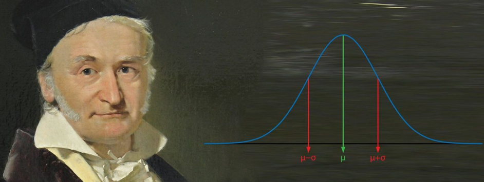

```{r setup, include=FALSE}
options(htmltools.dir.version = FALSE)
knitr::opts_chunk$set(echo = TRUE,
                      warning = FALSE,
                      message = FALSE,
                      fig.align = "center", 
                      fig.width = 6, fig.height = 4)
```

class: rstudio-slide, left, rstudio-overview
# 

```{r, echo=FALSE, out.width="750px", out.height="300px"}

```

> *“No es el conocimiento, sino el acto de aprendizaje; y no la posesión, sino el acto de llegar a ella, lo que concede el mayor disfrute”*  
>  
> *Carl Friedrich Gauss*

---
class: rstudio-slide, left
# Statistical Learning

- <tsub>Aprendizaje desde los datos.</tsub>
- Tipos de aprendizaje:
    - Supervisado
        - Problemas de regresión (respuesta cuantitativa)
        - Problemas de clasificación (respuesta categórica)
            - Binaria
            - Multinomial o multiclase
    - No supervisado
        - Reducción de dimensinalidad
        - Clusterización
- Aunque el término *Statistical Learning* es relativamente nuevo, muchos de los conceptos subyacentes fueron desarrollados tiempo atrás.

---
class: rstudio-slide, left
# Statistical Learning: Historia corta


- **Siglo XIX:** [Adrien Marie Legendre](https://en.wikipedia.org/wiki/Adrien-Marie_Legendre) y [Carl Friedrich Gauss](https://en.wikipedia.org/wiki/Carl_Friedrich_Gauss) publicaron el *método de los mínimos cuadrados*. Esta primera aproximación fue aplicada en problemas de astronomía y es lo que ahora se conoce como *regresión lineal*.
- **Siglo XX:** en 1936 [Ronald Aylmer Fisher](https://es.wikipedia.org/wiki/Ronald_Fisher) desarolló el método de *análisis discriminante lineal* para predecir respuestas categóricas, lo que hoy conocemos bajo el nombre de *clasificación* en machine learning.
- **Siglo XX:** cerca a 1940 varios autores propusieron el método de [*regresión logística*](https://rpubs.com/Edimer/540368).
- **Siglo XX:** A principios de 1970, [*Nelder y Wedderburn*](https://en.wikipedia.org/wiki/John_Nelder)  acuñaron el término *modelos lineales generalizados*.

---
class: rstudio-slide, left
# Statistical Learning: Historia corta

- **Siglo XX:** a finales de la década de 1970 muchas técnicas habían sido desarrolladas, no obstante, en su mayoría bajo ecuaciones *lineales*.
- **Siglo XX:** a mitad de la década de 1980, la tecnología computacional permitió mejorar los métodos *no lineales*, siendo [Leo Breiman](https://en.wikipedia.org/wiki/Leo_Breiman), [Jerome Friedman](https://en.wikipedia.org/wiki/Jerome_H._Friedman), [Richard Olshen](http://statweb.stanford.edu/~olshen/) y [Charles Stone](https://www.math.ucla.edu/news/memoriam-charles-stone) quienes introdujeron los [*árboles de regresión y clasificación (CART)*](https://www.digitalvidya.com/blog/classification-and-regression-trees/).
- **Siglo XX:** en 1986 [Trevor Hastie](https://en.wikipedia.org/wiki/Trevor_Hastie) y [Robert Tibshirani](https://en.wikipedia.org/wiki/Robert_Tibshirani) acuñaron el término *modelos aditivos generalizados*, como una extensión *no lineal* de los *modelos lineales generalizados*.
- **Actualidad:** técnicas como las [Redes Neuronales Artificiales](https://en.wikipedia.org/wiki/Artificial_neural_network) y el [Deep Learning](https://en.wikipedia.org/wiki/Deep_learning), están siendo utilizadas para resolver problemas en diversidad de campos.

---
class: rstudio-slide, left
# Modelo Lineal

- Posee numerosas asunciones (suposiciones matemáticas).
- Proporciona estabilidad, sin embargo, puede producir predicciones imprecisas.
- Pilar fundamental del análisis estadístico.
- Dado un vector de entradas $X^T = (X_1, X_2,..., X_p)$ se predice la variable $Y$ bajo el siguiente modelo:
$$\hat{Y} = \beta_0 +\sum_{j=1}^{p}X_j\beta_j$$

---
class: rstudio-slide, left
# Términos del modelo

- $\beta_0$: intercepto. Conocido como *bias* (*sesgo*) en Machine Learning.
- Incluyendo $\beta_0$ en el vector de coeficientes $\beta$, el modelo lineal puede ser escrito en forma de vector como un producto interno: $\hat{Y}=X^T\beta$.
- $X^T$: vector o matriz transpuesta (*inputs*)
- $\hat{Y}$: variable respuesta (*outputs*). En caso de tener una sola variable respuesta, ésta será un escalar, aunque $\hat{Y}$ puede ser un vector de longitud $K$, en cuyo caso $\beta$ será una matriz de coeficientes de dimensiones $p \times K$.
- En el espacio dimensional $p+1$ los *input-output* $(X, \hat{Y})$ representan un hiperplano.
- Visto como una función sobre el espacio de entrada $p-dimensional$, $f(X) = X^T\beta$, es lineal.  

---
class: rstudio-slide, left
# Ajuste del modelo

- ¿Cómo ajustar el modelo lineal en un conjunto de datos de *training*?
- Múltiples métodos diferentes de ajuste, siendo uno de los más populares el de [*mínimos cuadrados.*](https://link.springer.com/referenceworkentry/10.1007/978-0-387-32833-1_228)
- Bajo esta aproximación, elegimos los coeficientes $\beta$ que minimicen la suma de cuadrados residual (*Residual Sum of Squares - RSS*): $$RSS(\beta) = \sum_{i=1}^{N}(y_i-x_i^T\beta)^2$$
- $RSS(\beta)$ es una función cuadrática de los parámetros, y por lo tanto este mínimo siempre existe, pero puede no ser único.

---
class: rstudio-slide, left
# RSS Matricial

- En notación matricial se puede escribir: $$RSS(\beta) = (y - X\beta)^T(y - X\beta)$$
- $X$ es una matriz $N \times p$ con cada fila como un vector de entradas y $y$ es un vector de salidas en el conjunto de datos de entrenamiento.
- Derivando respecto a $\beta$ se obtienen las [*ecuaciones normales:*](https://link.springer.com/referenceworkentry/10.1007%2F978-0-387-32833-1_286) $$X^T(y-X\beta) = 0$$
- Si $X^TX$ es <tsub>[no singular](https://es.wikipedia.org/wiki/Singularidad_matem%C3%A1tica)</tsub>, entonces la única solución está dada por: $$\hat{\beta}=(X^TX)^{-1}X^Ty$$

---
class: rstudio-slide, left
# Función de pérdida (*loss*)

- Con $X \in \rm I\!R^p$ que denota un vector de entrada con valores aleatorios.
- Con $Y \in \rm I\!R$ siendo una variable (escalar) aleatoria de salida.
- Con distribcuión de probabilidad conjunta denotada por $\rm Pr(X, Y)$, se busca una función $f(X)$ para predecir $Y$, dado los valores de $X$.
- Esta teoría requiere una [función de pérdida - *loss function*](https://en.wikipedia.org/wiki/Loss_function) $L(Y, f(X))$ para penalizar los errores en la predicción.
- Una de las funciones de pérdida (también denominada *función de costo*) más común y conveniente es *squared error loss*: $$L(Y, f(X)) = (Y-f(X))^2$$

---
class: rstudio-slide, left
# Elección de $f$

- Error de predicción esperado (*Expected Prediction Error - EPE*): $$\mathrm{EPE}(f) = \mathrm{E}(Y-f(X))^2 = \int[y - f(x)]^2\ \mathrm{Pr}(dx, dy)$$
- Por condicionamiento en $X$, se puede escribir como: $$\mathrm{EPE}(f)=E_XE_{Y|X}\ ([Y - f(X)]^2 | X)$$
- Es suficiente minimizar EPE, cuyo resultado es la función de *regresión*: $$f(x) = \mathrm{argmin}_c\ \mathrm{E}_{Y|X}\ ([Y - c]^2 | X = x) = \mathrm{E}(Y|X=x)$$

---
class: rstudio-slide, left
# Consideraciones finales

- Bajo ciertas condiciones de regularidad en la distribución de probabilidad conjunta $(\mathrm{Pr}(X, Y))$, cuando $N \longrightarrow \infty$, se puede probar: $$\hat{f}(x) \longrightarrow \mathrm{E}(Y|X=x)$$
- La función de regresión $f(x)$ asume que la relación es lineal en los parámetros: $f(x) \approx x^T\beta$
- Juntando el modelo lineal para $f(x)$ en *EPE* y derivando, se puede resolver para $\beta$: $$\beta = [\mathrm{E}XX^T]^{-1}\mathrm{E}(XY)$$

---
class: rstudio-slide, left
# Recurso de información - Teoría

- [The Elements of Statistical Learning: Data Mining, Inference, and Prediciont.](https://web.stanford.edu/~hastie/ElemStatLearn/)

```{r, echo=FALSE, out.width="310px"}
knitr::include_graphics("https://pbs.twimg.com/media/C6-1zRtWsAAKRcG.jpg")
```

---
class: rstudio-slide, left
# Recurso de información - Práctica

- [An Introduction to Statistical Learning: with Applications in R](http://faculty.marshall.usc.edu/gareth-james/ISL/)

```{r, echo=FALSE, out.width="230px"}
knitr::include_graphics("http://faculty.marshall.usc.edu/gareth-james/ISL/ISL%20Cover%202.jpg")
```

---
class: rstudio-slide, left
# Recurso de información - Conceptos

- [*The Concise Encyclopedia of Statistics - Springer*](https://link.springer.com/referencework/10.1007/978-0-387-32833-1)

```{r, echo=FALSE, out.width="250px"}
knitr::include_graphics("https://media.springernature.com/w306/springer-static/cover-hires/book/978-0-387-32833-1")
```
