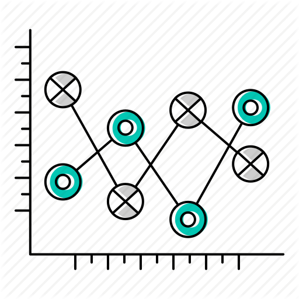

## <tyear>Statistical Learning</tyear>

<h3>Machine Learning con R</h3>
 

[Ejemplo de uso: `caret` y `keras`](https://rpubs.com/Edimer/536034)

<h3>Machine Learning con Tensorflow y R</h3>

[Predicción de abandono de clientes](https://www.rpubs.com/Edimer/564284)

<h3>Notas de *Statistical Learning*</h3>
 

[El Modelo Lineal: Mínimos Cuadrados ](documents_R/LinearModels_LeastSquares/LinearModels_LeastSqauares.html)

<h3>Regresión Lineal Simple con R</h3>

[RLS con R: gasto militar vs gasto en educación](https://unal-semilleror-facca.github.io/Actividades/regsimple.html#1)

 

<h3>Regresión Lineal Múltiple con R</h3>

[Comparación de modelos: PLOS ONE](https://rpubs.com/Edimer/565984)

<h3>Regresión Logística y Probit con R</h3>

[Detección de oxalatos en orina](https://rpubs.com/Edimer/540368)

<h3>Clasificación no supervisada</h3>
  

[Procesamiento raster con R](https://rpubs.com/Edimer/519971)

<h3>Clusterización con R</h3>

[Ejemplo práctico en biología](https://estudior.github.io/guias_descriptiva/14_Cluster.html#(1))

<h3>Clasificación supervisada</h3>
  

[Clasificación de correos spam](https://rpubs.com/Edimer/534566)

<h3>Componentes Principales con R</h3>

[Ejemplo práctico en biología](https://estudior.github.io/guias_descriptiva/13_ACP_Gorriones.pdf)

 

<tyear>___________________________________________________________________________________________________________</tyear>

## <tyear>Statistical Inference</tyear>

<h3>Inferencia estadística con R</h3>
 

[Ejemplos de inferencia estadística](https://bioestadistica.github.io/Temas/20_ejemplos.html)

<h3>Diseño experimental con R</h3>
  

[Introducción al diseño de experimentos con R](https://estudior.github.io/guias_experimentos/1_Introduccion.html#(1))

 

<tyear>___________________________________________________________________________________________________________</tyear>

## <tyear>Exploratory Data Analysis</tyear>

<h3>Correlaciones con R</h3>
 

[Ejemplo con datos del Banco Mundial](https://unal-semilleror-facca.github.io/Actividades/CorRLS.html)

<h3>Exploración de datos con R</h3>
  

[Casos y muertes de VIH en Colombia](https://rpubs.com/Edimer/326811)

<h3>Exploración de datos con R</h3>
  

[Parque automotor vs calidad de aire en Colombia](https://rpubs.com/Edimer/481799)

<h3>Exploración de datos con R</h3>

[Homicidios en Colombia año 2017](https://rpubs.com/Edimer/467653)

 

<h3>Exploración de datos con R</h3>

[Accidentalidad en motocicletas - Medellín](https://rpubs.com/Edimer/534624)

<tyear>___________________________________________________________________________________________________________</tyear>

## <tyear>Visualization</tyear>

<h3>Gráficación con `graphics` en R</h3>
 

[`graphics`: introducción](https://estudior.github.io/guias_descriptiva/8_GraficacionBase.html#(1))

<h3>Graficación con `lattice` en R</h3>
  

[`lattice`: introducción](https://estudior.github.io/guias_descriptiva/9_Graf_lattice.html#(1))

<h3>Graficación con `ggplot2` en R</h3>
  

[`ggplot2`: introducción](https://estudior.github.io/guias_descriptiva/10_Graf_ggplot.html#(1))

<h3>Sistemas de graficación con R</h3>
  

[Gráficos estáticos e interactivos](https://rpubs.com/Edimer/563530)

 

<tyear>___________________________________________________________________________________________________________</tyear>

## <tyear>Data Manipulation</tyear>

<h3>Manejo de datos con R</h3>
 

[Manejo de datos: Introducción](https://estudior.github.io/guias_descriptiva/7_ManejoDatosR.html#1)

<h3>Mundo R + Tidyverse: I</h3>
  

[Datos ordenados con tidyverse](https://unal-semilleror-facca.github.io/Actividades/2_MundoR.html#/mundo-r-tidyverse-i)

<h3>Mundo R + Tidyverse: II</h3>
  

[Datos ordenados con tidyverse](https://unal-semilleror-facca.github.io/Actividades/2_MundoR.html#/mundo-r-tidyverse-i)

<h3>Estructuración de datos con R</h3>
  

[Ejemplo con datos del Banco Mundial](https://rpubs.com/Edimer/515789)

 

<tyear>___________________________________________________________________________________________________________</tyear>

## <tyear>Guides for R</tyear>

<h3>Introducción a R y RStudio</h3>
 

[R y Rstudio: introducción](https://unal-semilleror-facca.github.io/Actividades/1_Intro.html#/introduccion-a-r-y-rstudio)

<h3>Ecosistema RMarkdown: I</h3>
  

[RMarkdown: Introducción I](https://unal-semilleror-facca.github.io/Actividades/1_RMarkdown.html#/ecosistema-r-markdown-i)

<h3>Ecosistema RMarkdown: II</h3>
  

[RMarkdown: Introducción II](https://unal-semilleror-facca.github.io/Actividades/1.2_RMarkdown.html#/ecosistema-r-markdown-ii)

<h3>Herramientas de programación</h3>

[R, RStudio, Git y Github](https://unal-semilleror-facca.github.io/Actividades/GuiasR.html)

 

<h3>Construcción de paquetes con R</h3>
 

[Tutorial: creando paquetes en R](https://edimer-blogr.netlify.com/projects/genr0-1/)

<h3>`hexSticker` y `available` en R</h3>
  

[Stickers para R](https://edimer-blogr.netlify.com/projects/genr/)

 

<tyear>___________________________________________________________________________________________________________</tyear>