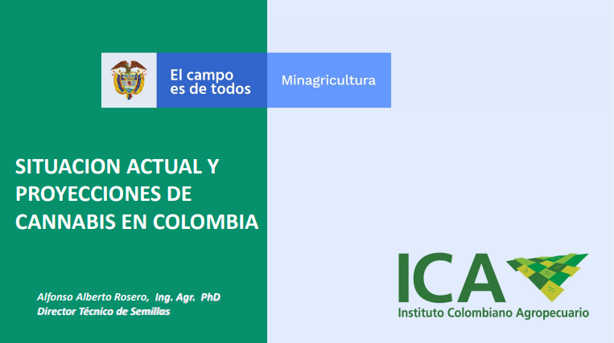

class: inverse, center, middle

# 

<center>

</center>


---

class: inverse, center, middle

# Diseño de experimentos: introducción
<html><div style='float:left'></div><hr color='#EB811B' size=1px width=720px></html> 

<center>

</center>


---

# Ronald Fisher

- [La Estadística una ciencia del sigo XX. R.A. Fisher, el genio](https://revistas.unal.edu.co/index.php/estad/article/view/28348/28693)

.pull-left[

<center>

</center>

]

.pull-right[

<center>

</center>

- [Scientific method: Statistical errors](https://www.nature.com/news/scientific-method-statistical-errors-1.14700)

]

---

# El arte de la experimentación

.pull-left[ 

#### ¿Por qué hacer un experimento?

- Determinar las principales causas de variación en una respuesta medida
- Encontrar las condiciones que dan lugar a una respuesta máxima o mínima
- Comparar las respuestas logradas en diferentes entornos de variables controlables
- Obtener un modelo matemático para predecir respuestas futuras

#### Técnicas fundamentales

- Replicación `->`  Incrementa precisión
- Bloqueo `->` Incrementa precisión
- Aleatorización `->` Reduce el sesgo

]

.pull-right[

<br>

<center>

</center>


]

---

class: inverse, center, middle

# Evaluación Agronómica en Cannabis: Experimento y Análisis Estadístico
<html><div style='float:left'></div><hr color='#EB811B' size=1px width=720px></html>

<center>

</center>

---

# Guía práctica

- [Tomado de *Situación actual y proyecciones del cannabis en Colombia*](https://www.acosemillas.com/wp-content/uploads/2019/10/3.-ICA-CANNABIS-MEDICINAL-CONGRESO.pdf)

<center>

</center>

.pull-left[

#### Diseño Experimental

- Bloques Completos al Azar con 3 repeticiones.
- Cada unidad experimental deberá estar compuesta mínimo por 20 plantas
- Variables: Longitud del peciolo (cm), Número de foliolos, THC (%), CBD (%), otras...

]

.pull-right[

#### Análisis Estadístico

- Variables cualitativas: Análisis de Frecuencias
- Variables Cuantitativas: Análisis Varianza – Comparación Medias (Duncan, Tukey, LSD)

]


---

class: inverse, center, middle

# Ejemplo de análisis con R
<html><div style='float:left'></div><hr color='#EB811B' size=1px width=720px></html>

<center>

</center>

---

# Datos y resumen descriptivo

```{r}
datos <- read.csv("data/data_ejemplo.csv")
head(datos)
```


```{r}
summary(datos)
```

---

# Distribución por genotipo

```{r, warning=FALSE, message=FALSE, fig.align='center', fig.height=5.5, fig.width=9}
library(tidyverse)
datos %>% ggplot(aes(x = Genotipo, y = Altura)) +
  geom_boxplot() + labs(y = "Altura (cm)")
```

---

# Distribución por genotipo  y bloque

```{r, warning=FALSE, message=FALSE, fig.align='center', fig.height=5.5, fig.width=9}
datos %>% ggplot(aes(x = Genotipo, y = Altura)) +
  facet_wrap(~Bloque) +
  geom_boxplot() + labs(y = "Altura (cm)")
```

---

# Hipótesis y Modelo Matemático

### Modelo General

$$y_{ij} = \mu + \alpha_i + \beta_j + \epsilon_{ij},\ i = 1, 2, 3,\  j = 1, 2, 3$$

### Hipótesis Principal

$$H_0: \alpha_1 = \alpha_2 = \alpha_3 = 0 \\
H_1: Algún\ \alpha_i\ diferente\ de\ 0$$

### Hipótesis Verificación

$$H_0: \beta_1 = \beta_2 = \beta_3 = 0 \\
H_1: Algún\ \beta_i\ diferente\ de\ 0$$

---

# Ajuste del modelo

```{r}
modelo <- aov(Altura ~ Genotipo + Bloque, data = datos)
summary(modelo)
```

- **Error aleatorio del modelo $\sigma^2$:**

```{r}
# Estimador de la varianza del error aleatorio
varErr <- summary(modelo)[[1]]$"Mean Sq"[3]

# Estimación de la desviación estándar del error aleatorio
desvErr <- sqrt(varErr)
desvErr
```

---

# Diagnósticos del modelo

```{r, warning=FALSE, message=FALSE, fig.align='center', fig.height=5.5, fig.width=9}
par(mfrow = c(2, 2))
plot(modelo)
```

---

# Comparación de medias (Tukey) - Tabla

```{r, warning=FALSE, message=FALSE, fig.align='center', fig.height=5.5, fig.width=9}
TukeyHSD(modelo)
```

---

# Comparación de medias (Tukey) - Gráfico Genotipos

```{r, warning=FALSE, message=FALSE, fig.align='center', fig.height=5.5, fig.width=9}
plot(TukeyHSD(modelo, which = "Genotipo"))
```

---

# Comparación de medias (Tukey) - Gráfico Bloque

```{r, warning=FALSE, message=FALSE, fig.align='center', fig.height=5.5, fig.width=9}
plot(TukeyHSD(modelo, which = "Bloque"))
```

---
class: inverse, center, middle

# Material de apoyo
<html><div style='float:left'></div><hr color='#EB811B' size=1px width=720px></html>

---

# Repositorio Github

<br>
<center>

</center>

.footnote[
[1] [Diapositivas, código fuente y datos.](https://github.com/Edimer/AgroR/tree/master/Cannabis-Statistics-Palmira)
]

---
class: inverse, center, middle

# ¡Gracias!

<html><div style='float:left'></div><hr color='#EB811B' size=1px width=720px></html> 

<center>

</center>

