class: inverse, center, middle

# Shiny
<html>

</html> 

---
# ¿Qué es Shiny?

> *"Shiny es un paquete de código abierto que proporciona un marco elegante y potente para crear aplicaciones web utilizando R. Shiny le ayuda a convertir sus análisis en aplicaciones web interactivas sin necesidad de conocimientos de HTML, CSS o JavaScript."*

> **RStudio.**

 

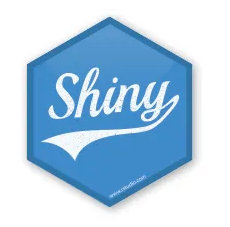

---
# El problema...

 
 
 

<!--Resaltando texto en color .red[rojo], .orange[naranja] y .blue[azul].-->

---
# Data Science

 
 
 

---
class: inverse, center, middle

# Esctructura de App
<html>

</html>

---
# UI - Server

 
 
 

---
# UI - Server: Simple

 
 
 

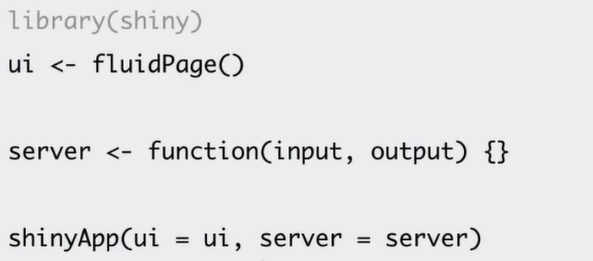

---
# UI - Server: Múltiple

 

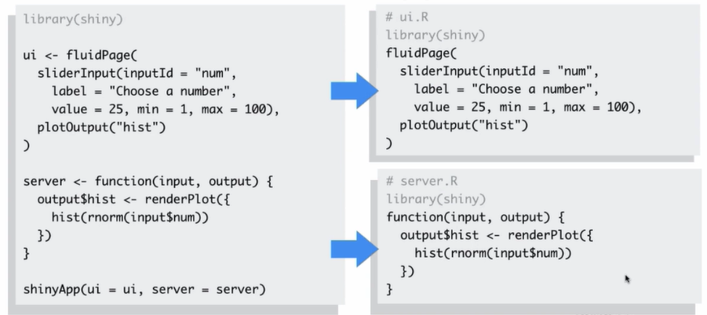

---
class: inverse, center, middle

# Inputs - Outputs
<html>

</html> 

---
# Inputs

 

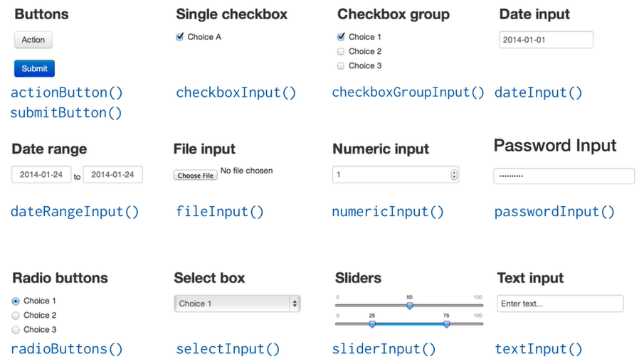

---
# Outputs

 

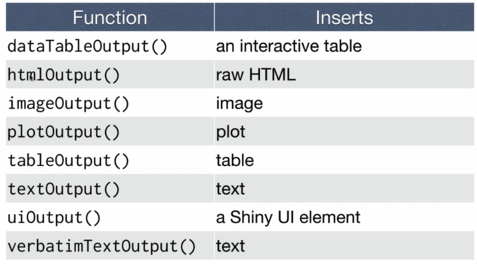

---
# Render*

 

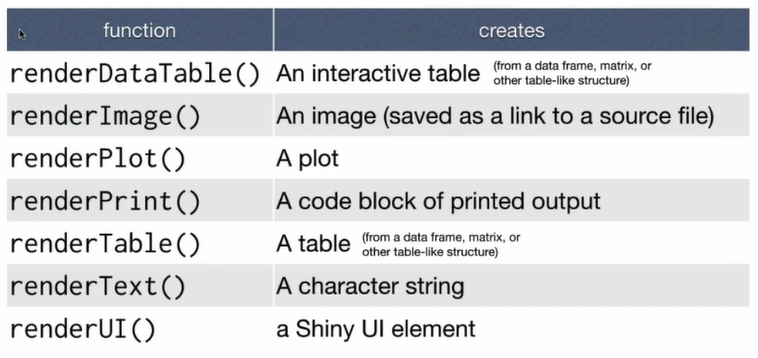

---
# Output

 
 
 

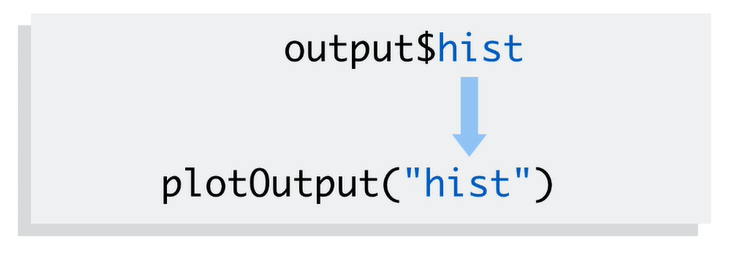

---
# Input - Output

---
class: inverse, center, middle

# Otras características
<html>

</html> 

---
# Diseños

 

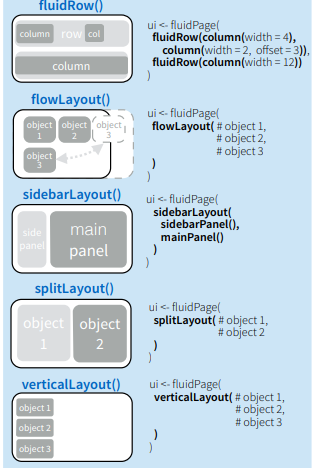

---
# Elementos HTML

 
 
 
 

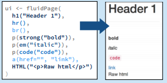

---
class: inverse, center, middle

# Compartir Apps
<html>

</html> 

---
# ShinyApps.io

 
 

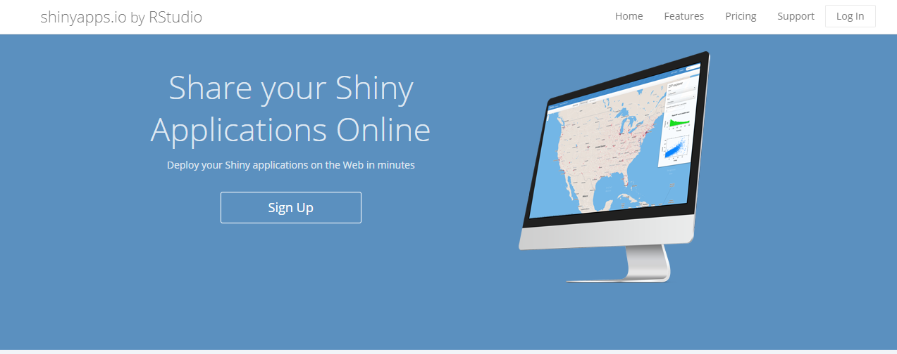

.footnote[
[1] [ShinyApps.io](https://www.shinyapps.io/)
]

---

# RStudio Connect

 
 

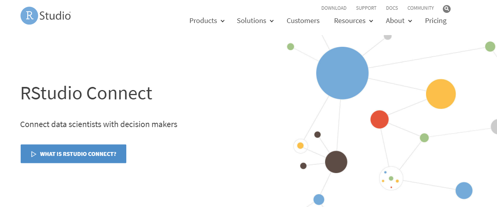

.footnote[
[1] [RStudio Connect](https://rstudio.com/products/connect/)
]

---
class: inverse, center, middle

# Recursos de Información
<html>

</html>

---

# Mastering Shiny

.footnote[
[1] [Libro Mastering Shiny](https://mastering-shiny.org/)
]

 

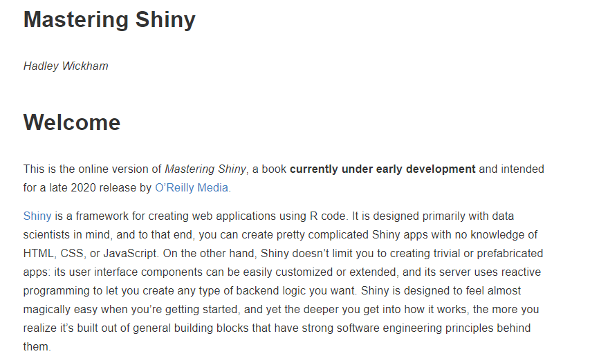

---

# Golemverse

.footnote[
[1] [Golemverse](https://golemverse.org/)
]

 

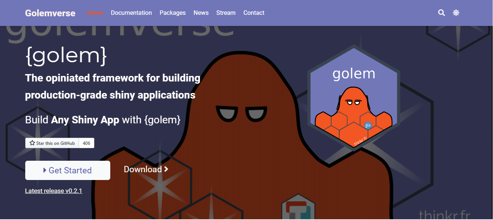

---
# Otros

- [Shiny guía español](https://rstudio.com/wp-content/uploads/2015/03/shiny-spanish.pdf)
- [Learn Shiny - Garret Grolemund](https://shiny.rstudio.com/tutorial/)
- [Hoja de referencia Shiny (Español)](https://rstudio.com/wp-content/uploads/2015/03/shiny-spanish.pdf)
- [Hoja de referencia Shiny (Inglés)](https://shiny.rstudio.com/images/shiny-cheatsheet.pdf)

.footnote[
[1] Nota: todas las imágenes de esta presentación fueron obtenidas de [Learn Shiny - Garret Grolemund.](https://shiny.rstudio.com/tutorial/)
]

---
class: inverse, center, middle

# Material de apoyo
<html>

</html>

---

# Repositorio Github

 

.footnote[
[1] [Código fuente y datos - *IntroShiny_Unal2020*.](https://github.com/Edimer/AgroR)
]

---
class: inverse, center, middle

# ¡Gracias!

<html>

</html> 

