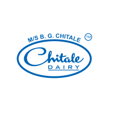
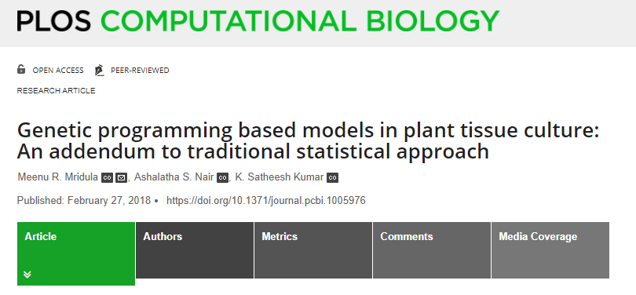

class: inverse, center, middle

# Lenguaje de programación
<html>

</html> 

---

# Concepto

.pull-left[
 

]

.pull-right[
 
- Un lenguaje de programación es un lenguaje formal, es decir, un lenguaje con reglas gramaticales bien definidas. Le proporciona a una persona (programador) la capacidad de escribir instrucciones o secuencias de órdenes en forma de algoritmos con el fin de controlar el comportamiento físico o lógico de una computadora, de manera que se puedan obtener diversas clases de datos o ejecutar determinadas tareas.
]

.footnote[
[1] [Tomado de wikipedia](https://es.wikipedia.org/wiki/Lenguaje_de_programaci%C3%B3n)
]

---
class: inverse, center, middle

# Software libre
<html>

</html> 

---

# Definición y 4 libertades

> "*«Software libre» es el software que respeta la libertad de los usuarios y la comunidad. A grandes rasgos, significa que los usuarios tienen la libertad de ejecutar, copiar, distribuir, estudiar, modificar y mejorar el software. Es decir, el «software libre» es una cuestión de libertad, no de precio. Para entender el concepto, piense en «libre» como en «libre expresión», no como en «barra libre».*"

## 4 Libertades del software libre

- La libertad de ejecutar el programa como se desee, con cualquier propósito (libertad 0).
- La libertad de estudiar cómo funciona el programa, y cambiarlo para que haga lo que usted quiera (libertad 1).
- La libertad de redistribuir copias para ayudar a otros (libertad 2).
- La libertad de distribuir copias de sus versiones modificadas a terceros (libertad 3).

.footnote[
[1] [gnu.org](https://www.gnu.org/philosophy/free-sw.es.html)
]

---

# Free Software Foundation (FSF)

## *Richard Stallman*

.footnote[
[1] [Página web de FSF.](https://www.fsf.org/es)
]

---
class: inverse, center, middle

# Lenguaje R
<html>

</html>

---

# Lenguaje R

- R es un lenguaje de distribución libre (bajo la [licencia GPL - General Public License](https://en.wikipedia.org/wiki/GNU_General_Public_License)), interpretado y de gran uso en la manipulación de datos para el cómputo estadístico y gráfico. Disponible para Linux, MacOS y Windows. R fue creado por Ross Ihaka y Robert Gentleman a principios de los años 90 en Nueva Zelanda, y puede ser definido como una implementación del lenguaje S, este último desarrollado en AT&T por John Chambers, Rick Becker y Allan Wilks.

- John Chambers y Trevor Hastie en el año 1991 describen en el texto Statistical Models in S:

> *"Buscamos que los usuarios puedan iniciar en un entorno interactivo, en el que no se vean, conscientemente, a ellos mismos como programadores. Conforme sus necesidades sean más claras y su complejidd se incremente, deberían gradualmente poder profundizar en la programación, es cuando los aspectos del lenguaje y el sistema se vuelven más importantes".*

---

# Top Lenguajes 2019

 

.footnote[
[1] [ieee.org](https://spectrum.ieee.org/computing/software/the-top-programming-languages-2019)
]

---
class: inverse, center, middle

# Tecnologías libres
<html>

</html>

---

# Software y Hardware Libre

 

---

# Open Data

 

- [Datos abiertos Colombia.](https://www.datos.gov.co/)
- [Datos abiertos Banco Mundial.](https://datos.bancomundial.org/)

---

class: inverse, center, middle

# ¿Ciencia de datos?
<html>

</html> 

---
# Ciencia de datos

 

---
# Científico de datos

 
 
 
 
 

.footnote[
[1] [Artículo.](https://hbr.org/2012/10/data-scientist-the-sexiest-job-of-the-21st-century)
]

<!--Resaltando texto en color .red[rojo], .orange[naranja] y .blue[azul].-->

---
# Conceptos relacionados

 

---
# Inteligencia Artificial (IA)

 

---
class: inverse, center, middle

# Machine Learning - Deep Learning
<html>

</html> 

---
# Machine Learning

> *"El aprendizaje automático es el estudio de algoritmos computacionales que permiten que los programas informáticos mejoren automáticamente a través de la experiencia"*
> **Tom Mitchell.**

.footnote[
[1] [Libro: Machine Learning (Tom Mitchell).](http://profsite.um.ac.ir/~monsefi/machine-learning/pdf/Machine-Learning-Tom-Mitchell.pdf)
]
 

---
# *Performance* vs volumen de datos

 
 

---
# Deep Learning

 

---
# Complejidad vs interpretación

 
 
 
 

--

- **.blue[¿Cuál es mi objetivo?]**
    - ¿Explicar?
    - ¿Predecir?

---
class: inverse, center, middle

# Mercado...

<html>

</html> 

---
# Uso masivo de la información

 
 
 
 

---

# Herramientas: software

 
 
 
 

---
class: inverse, center, middle

# Aplicaciones en agricultura
<html>

</html> 

---

# SIPRA: Colombia

.footnote[
[1] [Página web SIPRA Colombia.](https://sipra.upra.gov.co/)
]

 

---

# Agrosavia: sistemas de información

.footnote[
[1] [Sistemas de información Agrosavia.](https://www.agrosavia.co/productos-y-servicios/sistemas-de-informaci%C3%B3n)
]

 

---

# SoilGrids

- [Artículo SoilGrids.](https://journals.plos.org/plosone/article?id=10.1371/journal.pone.0169748)

.footnote[
[1] [Página web SoilGrids.](https://soilgrids.org/)
]

---

# Chitale: India

.footnote[
[1] [Página web Chitale.](https://www.chitalebandhu.in/)
]

---
class: inverse, center, middle

# Proceso de análisis de datos
<html>

</html>

---

# Entendimiento...

 
 

---
class: inverse, center, middle

# *Tidyverse*
<html>

</html>

---

# Componentes del Tidyverse

 
 
 
 

.footnote[
[1] [Página web tidyverse](https://www.tidyverse.org/)
]

---
class: inverse, center, middle

# Recursos de Información
<html>

</html>

---

# R para Ciencia de Datos

.footnote[
[1] [Libro: versión español.](https://es.r4ds.hadley.nz/)
]

 

---

# Libro vivo de Ciencia de Datos

 

.footnote[
[1] [Libro: versión español.](https://librovivodecienciadedatos.ai/)
]

---

# An Introduction to Statistical Learning

.footnote[
[1] [Libro: versión inglés.](http://faculty.marshall.usc.edu/gareth-james/ISL/)
]

 

---

# Más recursos...

- [CRAN (sitio oficial de R)](https://cran.r-project.org/)
- [RStudio (sitio oficial)](https://rstudio.com/)
- [Instalación de R y RStudio](https://rpubs.com/Edimer/675756)
- [Página web Edimer David Jaramillo](https://edimer.github.io/)
- [Blog R y Python - Edimer David Jaramillo](https://blogrpy.netlify.app/)
- [Blog RStudio News](https://blog.rstudio.com/categories/news/)
- [Apps con R y Shiny](https://shiny.rstudio.com/gallery/)
- [RPubs](https://rpubs.com/)
- [Stack Overflow en inglés](https://stackoverflow.com/)
- [Stack Overflow en español](https://es.stackoverflow.com/)
- [DataCamp](https://www.datacamp.com/)
- [Coursera](https://www.coursera.org/)
- [Github](https://github.com/)
- [edX](https://www.edx.org/es/course/subject/data-analysis-statistics)
- [R-Exercises](https://www.r-exercises.com/)
- [R-bloggers](https://www.r-bloggers.com/)
- [Conferencia TED: “Las mejores estadísticas que jamás hayas visto”](https://www.ted.com/talks/hans_rosling_the_best_stats_you_ve_ever_seen)
- [Proyecto Gapminder](https://www.gapminder.org/tools/#$chart-type=bubbles)

---

# Artículos relacionados

- [Modeling the Effects of Light and Sucrose on In Vitro Propagated Plants: A Multiscale System Analysis Using Artificial Intelligence Technology](https://journals.plos.org/plosone/article?id=10.1371/journal.pone.0085989#s6)
- [Development of support vector machine-based model and comparative analysis with artificial neural network for modeling the plant tissue culture procedures: effect of plant growth regulators on somatic embryogenesis of chrysanthemum, as a case study](https://link.springer.com/article/10.1186/s13007-020-00655-9)
- [Data-Driven Modeling in Plant Tissue Culture ](https://www.researchgate.net/profile/Mohsen_Yoosefzadeh_Najafabadi/publication/318100613_Data-Driven_Modeling_in_Plant_Tissue_Culture/links/597c270ba6fdcc1a9a8b0cec/Data-Driven-Modeling-in-Plant-Tissue-Culture.pdf)
- [The application of artificial neural networks in modeling and predicting the effects of melatonin on morphological responses of citrus to drought stress](https://journals.plos.org/plosone/article?id=10.1371/journal.pone.0240427)
- [Convolutional neural network for cell classification using microscope images of intracellular actin networks](https://journals.plos.org/plosone/article?id=10.1371/journal.pone.0213626)
- [Use of high-content analysis and machine learning to characterize complex microbial samples via morphological analysis](https://journals.plos.org/plosone/article?id=10.1371/journal.pone.0222528)

---
class: inverse, center, middle

# Ejemplo 

[Genetic programming based models in plant tissue culture: An addendum to traditional statistical approach](https://journals.plos.org/ploscompbiol/article?id=10.1371/journal.pcbi.1005976#sec008)

---
class: inverse, center, middle

# Material de apoyo
<html>

</html>

---

# Repositorio Github

 

.footnote[
[1] [Diapositivas, código fuente y datos.](https://github.com/Edimer/Unal-Palmira-Data-Science)
]

---
class: inverse, center, middle

# ¡Gracias!

<html>

</html> 

