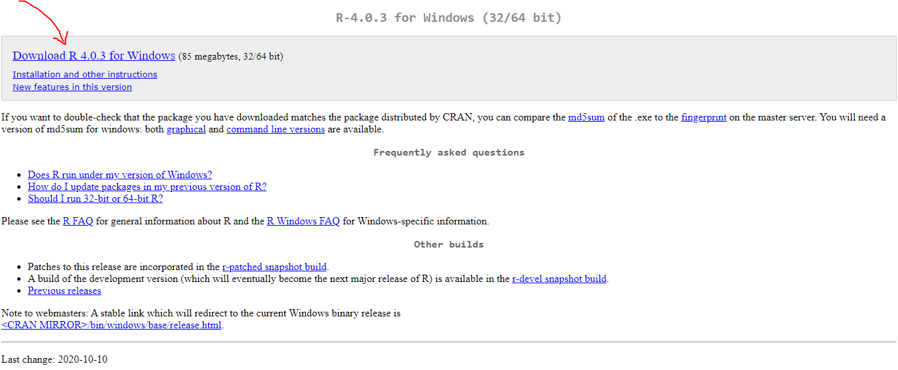
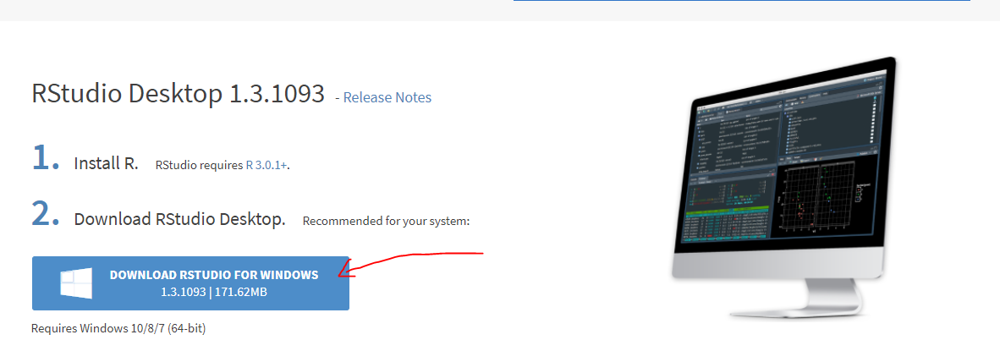

```{r setup, include=FALSE}
knitr::opts_chunk$set(echo = FALSE)
```

# Instalación de R y RStudio

## Descargar R

  1. Clic [aquí](https://cran.r-project.org/bin/windows/base/) para descargar la última versión de R para Windows. Si necesita la versión para Mac OS clic [aquí.](https://cran.r-project.org/bin/macosx/) Si es usuario de Linux se sugiere revise [este repositorio.](https://cran.r-project.org/bin/linux/)

<center>

</center>

## Descargar RStudio

  2. Clic [aquí](https://rstudio.com/products/rstudio/download/) para descargar la última versión de [RStudio.](https://rstudio.com/)
  
<center>

</center>  

## Video de instalación

  3. Para la instalación de R y RStudio se recomienda ver el siguiente video.

<iframe width="560" height="315" src="https://www.youtube.com/embed/Nj6VlcKMmWc" frameborder="0" allowfullscreen></iframe>

# Temas principales de la reunión

<center>

</center> 

<center>

</center> 

# Libros sugeridos

- [R para principiantes](https://bookdown.org/jboscomendoza/r-principiantes4/)
- [R para Ciencia de Datos](https://es.r4ds.hadley.nz/)
- [Libro Vivo de Ciencia de Datos](https://librovivodecienciadedatos.ai/)
- [Gráficos con R](https://fhernanb.github.io/Graficos-con-R/)
- [Spatial Data Science with R](https://rspatial.org/)
- [Geocomputation with R](https://geocompr.robinlovelace.net/)

# Más sobre mi

- [Página web Edimer David Jaramillo](https://edimer.github.io/)
- [Perfil Github Edimer David Jaramillo](https://github.com/Edimer)
- [Perfil de RPubs Edimer David Jaramillo](https://rpubs.com/Edimer)

